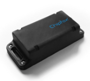
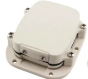
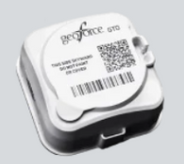
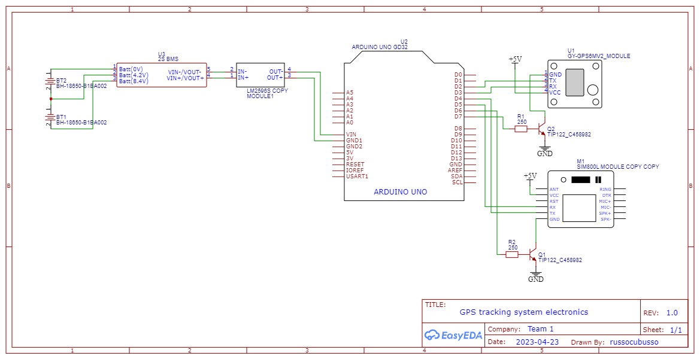
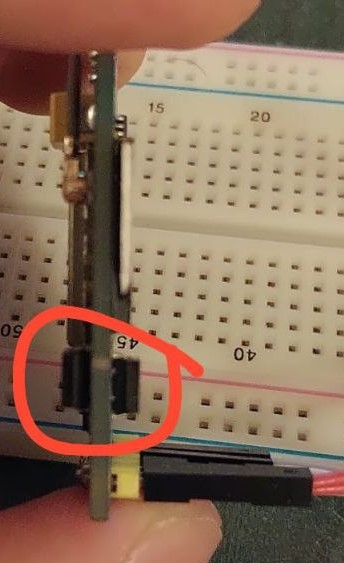
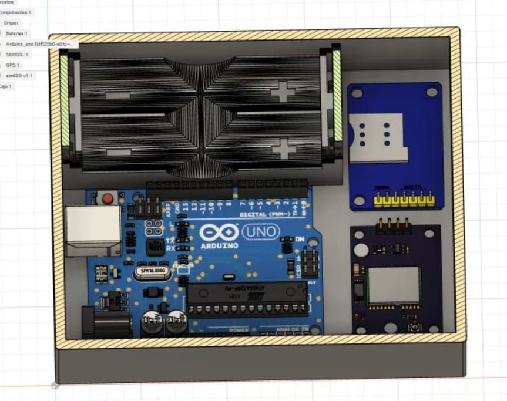
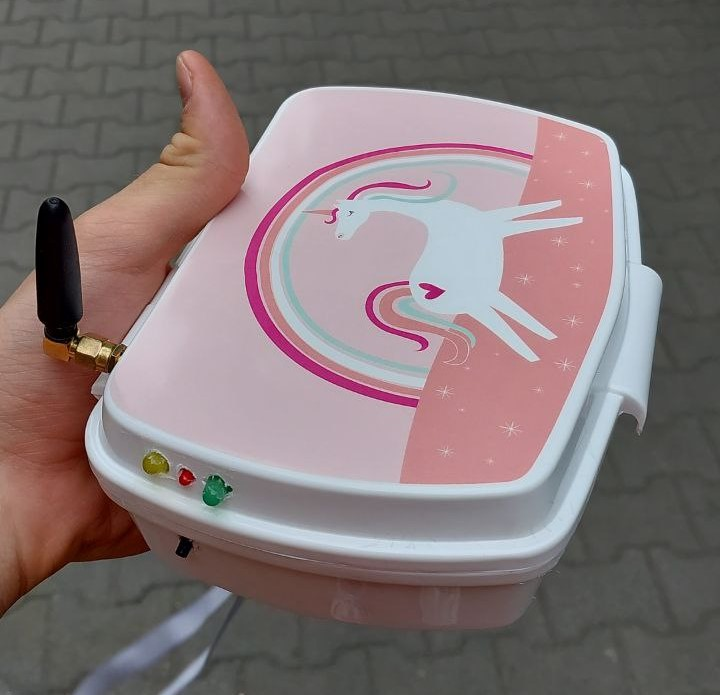
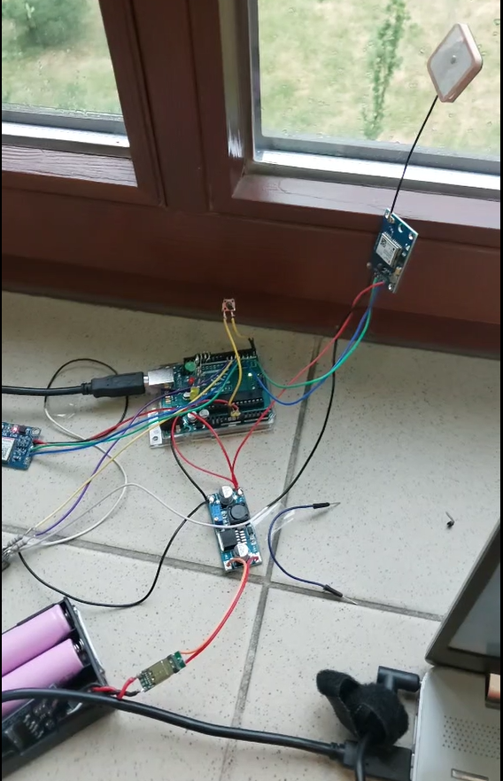
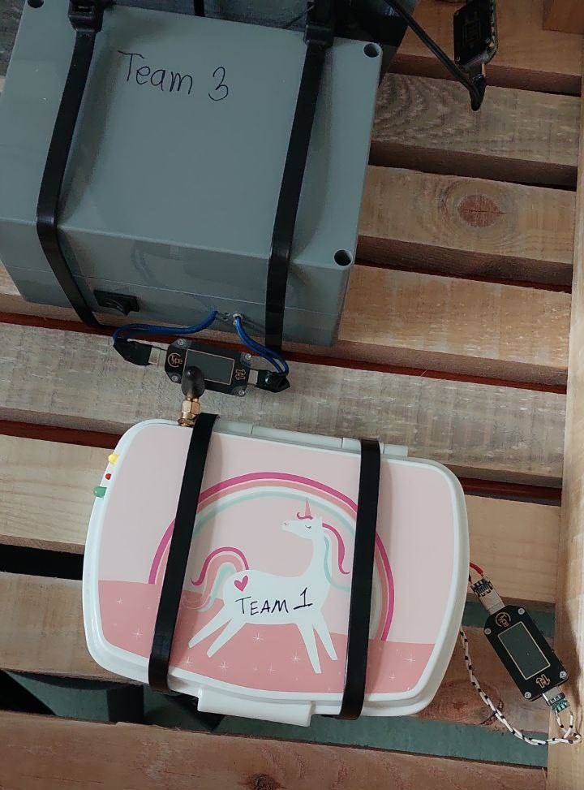

<h1>Car Sharing GPS tracking system project</h1>

This is the project to make a gps system for car sharing, that catches the car position by gps module and sends it via sms to dedicated phon number each 2 minutes. One of aim of this project was to make the system as much energy efficient as possible.

<h2><b>Project targets</b></h2> 

The first stage was to define the project targets. Those are:

<ul>
  <li>Small tracking device</li>
  <li>Lasting for a long time</li>
  <li>Adapted to railway conditions</li>
  <li>Sends location and status to user</li>
  <li>Cheaper than 500 PLN</li>
</ul>

Existing solutions:

<table>
  <tr>
    <th></th>
    <th></th>
    <th></th>
  </tr>
  <tr>
    <td>Has phone app</td>
    <td>Has phone app</td>
    <td>Has phone app</td>
  </tr>
  <tr>
    <td>3V 3000mAh</td>
    <td>4800mAh 550 days of work, if 1 report per day</td>
    <td>550 days of work, if 24 reports per day</td>
  </tr>
  <tr>
    <td>Uses SigFox network</td>
    <td>Uses Satellite for connection</td>
    <td>Uses Satellite for connection</td>
  </tr>
  <tr>
    <td><a href="https://partners.sigfox.com/products/chipfox-gps-tracker-heavy-duty">LINK</a></td>
    <td><a href="https://www.rewiresecurity.co.uk/sat50-satellite-asset-tracker">LINK</a></td>
    <td><a href="https://aliresources.hexagon.com/fabrication/geoforce-gt0-industrial-grade-gps-asset-tracker">LINK</a></td>
  </tr>
</table>

<h2><b>Project electronics</b></h2> 
<table>
  <tr>
    <th>Module</th>
    <th>Name</th>
    <th>Picture</th>
    <th>Power consumption</th>
    <th>Cost</th>
  </tr>
  <tr>
    <td>GSM</td>
    <td>SIM800L</td>
    <td>pic</td>
    <td>GSM transmission (average): 350 mA, 1.75W</td>
    <td>38,86 PLN</td>
  </tr>
  <tr>
    <td>GPS</td>
    <td>NEO6MV2</td>
    <td>pic</td>
    <td>67 mA, 0,335 W</td>
    <td>30 pln</td>
  </tr>
  <tr>
    <td>Microcontroller</td>
    <td>Arduino UNO</td>
    <td>pic</td>
    <td>250mW in regular mode, 1mW in powerdown sleep mode</td>
    <td>80 pln</td>
  </tr>
  <tr>
    <td>Battery</td>
    <td>18650</td>
    <td>pic</td>
    <td>-</td>
    <td>12 pln</td>
  </tr>
  <tr>
    <td>BMS</td>
    <td>BMS 2S1P</td>
    <td>pic</td>
    <td>-</td>
    <td>8 pln</td>
  </tr>
  <tr>
    <td>Power converter</td>
    <td>LM2596</td>
    <td>pic</td>
    <td>typically 10% from total power consumption</td>
    <td>10 pln</td>
  </tr>
</table>

<ul>
  <li>Total power consumption in regular mode ~= 2W * 1.1 = 2.2W</li>
  <li>Total power consumption with Arduino POWERDOWN sleep mode ~= 1.75W * 1.1 = 1.925W</li>
  <li>Total cost ~= 192 PLN</li>
</ul>

<h2><b>Circuit working principle and issues</b></h2>

Batteries are connected in series, and connected to BMS circuit to prevent discharge. In total, we have 3000mAh and 5.4 - 8.4 V voltage range. Then, the power is being stepped-down by LM2596 circuit, which also can output stable signal even if input signal is changing. The step-down converters are usually can give more power and consume less power, than step-up. So that is why we didn't use 2 accumulators in 1S2P connection.

The GSM and GPS modules are connected through TIP122 NPN transistors (those just wetre available in the storage). There are 250 Ohm resistors connected to the transistor base, to prevent from overcurrent. Also, from datasheet, we can see, that at 20mA base current, the transistor can already handle more than 1A of current, which is enough for needs of each microcontroller.

The circuit works in the following algorithm:

<ul>
  <li>Arduino wakes up from sleep mode by interruption button or by exciding the sleep time</li>
  <li>The GPS module is being turned on, and data is being requested with some periodicity, till it returns non-zero output (not 0.00 0.00)</li>
  <li>The GPS module turns off</li>
  <li>The GSM module is being turned on, and message is being send after around 1 second from being turned on.</li>
  <li>The GSM module turns off</li>
  <li>Arduino goes to sleep mode for 2 minutes</li>
</ul>

Both GPS and GSM modules use UART to communicate with arduino. However, the Arduino UNO has only one physical Serial, we used instead 2 Software serial ports.

<h3>Issue with GSM module (fixed)</h3>

However, we had an issue with the GSM module, which wasn't able to turn on. Looking into the datasheet, the one thing was descovered about those modules. The module itself helps to minimize the amount of pins, and helps for easier antenna management. However, it has really strange voltage decreasing system.

The chip itslef works at around 4.2 volts, and the input voltage comes throug 2 power diodes (0.7V per each) connected in series. The voltage across the chip input was measured, and I realized, that with input of 5 volts, as we configured the step-down, the chip voltage was on the level of 3.6V. To reduce it, we connected the 5V power wire to the connection point of those diodes. Thus, the input signal was comming through only one diode, making 4.3 volts on chip itself. And it worked)

<h1>Final assembly</h1>

We planned to 3D printed the body. However, we hade an issue with 3D printer, and finally we just used a lunch box, because the system should be on the outside of the car, and shoud handle weather conditions. The lunch box is hermetical, so it is suitable replasement.

Final body:

First working prototype:

Look from the inside:

And finally, the competition part:

